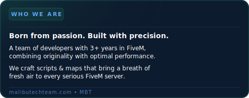
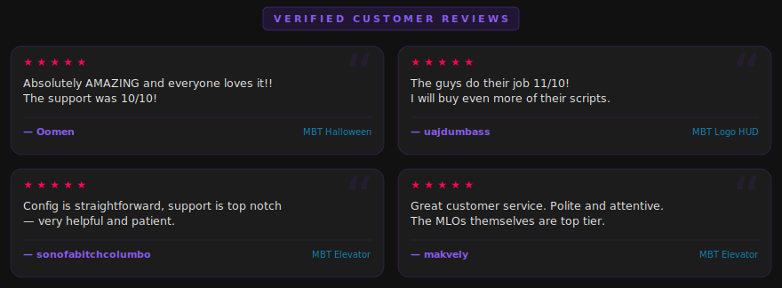

<div align="center">
  
</div>

<br/>

<div align="center">
  
</div>

<br/>

<div align="center">
  <a href="https://malibu-tech.tebex.io/">
    
  </a>
  <a href="https://iakko-maps.tebex.io/">
    
  </a>
  <a href="https://www.twitch.tv/malibutech">
    
  </a>
  <a href="https://www.youtube.com/@iakkomaps8702">
    
  </a>
  <a href="https://discord.gg/tqk3kAEr4f">
    
  </a>
  <a href="https://ko-fi.com/malibutech">
    
  </a>
</div>

<br/>

<div align="center">
  
  &nbsp;&nbsp;
  <a href="https://www.dmca.com/Protection/Status.aspx?ID=91018a5c-ecd2-440d-8a32-d94b2cecca80">
    
  </a>
</div>

<br/>
<br/>

<!-- ═══════════════════════════════════ THE TEAM ══════════════════════════════════ -->
<div align="center">
  
</div>

<br/>

<div align="center">
  
</div>

<br/>

| <a href="https://github.com/Moldrok"></a> | <a href="https://github.com/DarkSide0fTheCode"></a> | <a href="https://github.com/AndreIakko"></a> |
|:---:|:---:|:---:|
| **Moldrok** | **DarkSide0fTheCode** | **AndreIakko** |
|  |  |  |

<br/>
<br/>

<!-- ══════════════════════════════════ WHAT WE SHIP ══════════════════════════════ -->
<br/>

We make two kinds of things — and we try to make both exceptional.

**Scripts** — polished Lua resources with clean NUI, deep config, and real performance. Plug-and-play, CFX Escrow protected.

**MLO + Scripts** — custom map assets shipped *with* their own dedicated script. One cohesive drop, not two separate things bolted together.

```lua
-- our philosophy, in code
local MalibuTech = {
    principles = { "reliability", "originality", "craft" },
    stack      = { "Lua", "JavaScript", "C#", "HTML/CSS", "Node.js", "MySQL" },
    frameworks = { "ESX", "QB-Core", "OX", "Standalone" },
    obsession  = "NUI polish + MLO integration",
}
```

<br/>

| <a href="https://github.com/MalibuTechTeam/mbt_meta_clothes"></a> | <a href="https://github.com/MalibuTechTeam/mbt_malisling"></a> |
|:---:|:---:|
| <a href="https://github.com/MalibuTechTeam/iak_yatchclub"></a> | <a href="https://github.com/MalibuTechTeam/mbt_minigames"></a> |

<br/>
<br/>

<!-- ══════════════════════════════════ TECH STACK ════════════════════════════════ -->
<div align="center">
  
</div>

<br/>

<div align="center">
  
</div>

<br/>
<br/>

<!-- ════════════════════════════════════ ACTIVITY ════════════════════════════════ -->
<div align="center">
  
</div>

<br/>

<div align="center">
  <picture>
    <source media="(prefers-color-scheme: dark)" srcset="https://raw.githubusercontent.com/MalibuTechTeam/MalibuTechTeam/output/github-snake-dark.svg"/>
    <source media="(prefers-color-scheme: light)" srcset="https://raw.githubusercontent.com/MalibuTechTeam/MalibuTechTeam/output/github-snake.svg"/>
    
  </picture>
</div>

<br/>
<br/>

<!-- ══════════════════════════════════ WHAT PEOPLE SAY ═══════════════════════════ -->
<div align="center">
  
</div>

<br/>
<br/>

<!-- ════════════════════════════════════ FOOTER ══════════════════════════════════ -->
<div align="center">
  <a href="https://malibu-tech.tebex.io/">
    
  </a>
  &nbsp;
  <a href="https://iakko-maps.tebex.io/">
    
  </a>
  &nbsp;
  <a href="https://malibutechteam.com/">
    
  </a>
  <br/><br/>
  <sub>
    <a href="https://discord.gg/tqk3kAEr4f">discord</a> &nbsp;·&nbsp;
    <a href="https://malibutechteam.com/">malibutechteam.com</a> &nbsp;·&nbsp;
    <a href="https://www.dmca.com/Protection/Status.aspx?ID=91018a5c-ecd2-440d-8a32-d94b2cecca80">dmca protected</a>
  </sub>
</div>

<br/>

<div align="center">
  
</div>
